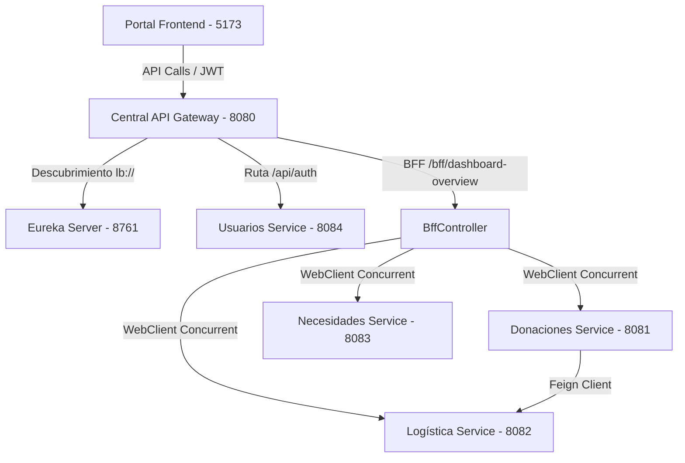

# Arquitectura del Sistema - Donaton

Este documento describe la arquitectura de software seleccionada y diseñada para el proyecto **Donaton**, enfocándose en la descentralización mediante microservicios y la comunicación interna.

---

## 1. Topología del Sistema
El proyecto Donaton está estructurado como una arquitectura orientada a microservicios autónomos, donde cada módulo representa un dominio del negocio, posee su propio esquema de base de datos e interactúa con los demás a través del API Gateway y comunicación directa REST.

La estructura consta de:
*   **Frontend (Portal):** SPA desarrollada en React con Vite. Se comunica directamente con la **Central** (BFF).
*   **Central (API Gateway + BFF):** Orquestador de peticiones y punto de entrada unificado. Contiene filtros de seguridad JWT y balanceo de carga.
*   **Eureka Server:** Servidor de registro de nombres de servicio. Permite que los microservicios se descubran dinámicamente sin hardcodear IPs ni puertos.
*   **Microservicios de Dominio:**
    *   **Usuarios:** Autenticación, registro y roles de usuario (ADMIN, USER).
    *   **Donaciones:** Gestión de donaciones, asignaciones y actualización de inventario.
    *   **Logística:** Gestión de centros de acopio y algoritmos de distribución de recursos.
    *   **Necesidades:** Registro y filtros de necesidades críticas reportadas en terreno.

---

## 2. Tabla de Puertos y Servicios
| Microservicio / Módulo | Puerto | Nombre en Eureka | Tipo de Base de Datos |
| :--- | :---: | :--- | :--- |
| **Eureka Server** | `8761` | Eureka Server dashboard | N/A |
| **Central (BFF/Gateway)** | `8080` | `central` | N/A |
| **Usuarios** | `8084` | `usuarios-service` | H2 Base de datos en archivo (`usuarios_db`) |
| **Donaciones** | `8081` | `donaciones-service` | H2 Base de datos en archivo (`donaciones_db`) |
| **Logística** | `8082` | `logistica-service` | H2 Base de datos en archivo (`logistica_db`) |
| **Necesidades** | `8083` | `necesidades-service` | H2 Base de datos en archivo (`necesidades_db`) |
| **Portal (Frontend)** | `5173` | Cliente Web React | N/A |

---

## 3. Flujo de Comunicación y Trazabilidad

1.  **Orquestación BFF:** Para renderizar el Dashboard principal, el portal realiza una única petición `GET http://localhost:8080/bff/dashboard-overview`. La clase `BffController` en la Central invoca en paralelo (usando programación reactiva WebFlux/Project Reactor) a Donaciones, Logística y Necesidades. Combina los DTOs y retorna un único JSON consolidado con estadísticas y estados de salud.
2.  **Sincronización Inter-servicio:** Al registrar una donación en `DonacionService` (puerto 8081), se valida primero que el centro de acopio destino exista en el servicio de Logística (puerto 8082) mediante el cliente HTTP declarativo `LogisticaClient` (Spring Cloud OpenFeign). Si el centro existe, se completa la donación y se actualiza de forma síncrona el inventario en el centro correspondiente.
3.  **Tolerancia a fallos:** El Gateway está configurado con **Resilience4j Circuit Breaker**. Si el microservicio de Donaciones o Logística experimenta caídas, el tráfico se redirige a endpoints de fallback (ej: `/fallback/donaciones`) que retornan mensajes de contingencia y evitan propagar el error en cascada.
